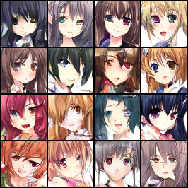
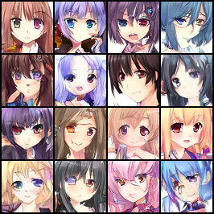

# 基于动漫头像的 Rectified Flow

数据来源：https://github.com/wangjia184/diffusion_model.git


这是一个面向深度学习初学者的无条件图片生成练习项目。项目使用 PyTorch、残差 U-Net 和最基础的 Rectified Flow，也不使用类别或文本条件。

项目支持使用 Conda 管理本地 Python 环境。代码、数据、模型权重和 TensorBoard 日志均保存在当前项目目录。

# V1.0基础版本

## 1. 模型原理

定义：

```text
x0 ~ N(0, I)                    # 源分布：高斯噪声
x1 ~ p_data                     # 目标分布：真实图片
t  ~ Uniform(0, 1)
xt = (1 - t) * x0 + t * x1     # 线性插值
目标速度 = x1 - x0
```

U-Net 接收 `xt` 和时间 `t`，学习速度场：

```text
v_theta(xt, t) ≈ x1 - x0
loss = MSE(v_theta(xt, t), x1 - x0)
```

生成时从新的高斯噪声出发，用前向欧拉法从 `t=0` 积分到 `t=1`：

```text
x <- x + dt * v_theta(x, t)
```

## 2. U-Net 网络设计

模型不是直接预测最终图片，而是接收插值状态 `x_t` 和时间 `t`，输出与图片形状相同的速度场 `v_theta(x_t, t)`。默认输入输出均为 `[B, 3, 64, 64]`，可训练参数约为 23.72M。

默认配置：

```yaml
model:
  in_channels: 3
  out_channels: 3
  base_channels: 64
  channel_multipliers: [1, 2, 4, 4]
  num_res_blocks: 2
  time_embedding_dim: 256
  dropout: 0.0
```

整体结构：

```text
x_t: [B, 3, 64, 64]
        │
        ▼
3×3 Conv → [B, 64, 64, 64]
        │
        ├── Encoder level 0: 2×ResBlock, 64 ch, 64×64
        │                    ↓ 3×3 stride-2 Conv
        ├── Encoder level 1: 2×ResBlock, 128 ch, 32×32
        │                    ↓ 3×3 stride-2 Conv
        ├── Encoder level 2: 2×ResBlock, 256 ch, 16×16
        │                    ↓ 3×3 stride-2 Conv
        └── Encoder level 3: 2×ResBlock, 256 ch, 8×8
                             │
                             ▼
                  Middle: 2×ResBlock, 256 ch
                             │
                             ▼
        ┌── Decoder level 3: 3×ResBlock, 256 ch, 8×8
        │                    ↑ nearest interpolation + 3×3 Conv
        ├── Decoder level 2: 3×ResBlock, 256 ch, 16×16
        │                    ↑ nearest interpolation + 3×3 Conv
        ├── Decoder level 1: 3×ResBlock, 128 ch, 32×32
        │                    ↑ nearest interpolation + 3×3 Conv
        └── Decoder level 0: 3×ResBlock, 64 ch, 64×64
                             │
                             ▼
              GroupNorm → SiLU → 3×3 Conv
                             │
                             ▼
                 v_theta: [B, 3, 64, 64]
```

编码器每个分辨率层包含 2 个残差块，并在层与层之间使用 `3×3、stride=2` 卷积下采样。解码器从编码器保存的特征中按相反顺序取出 skip connection，与当前特征在通道维拼接；每个分辨率层使用 3 个残差块，以消费对应层的跳跃特征。上采样采用最近邻插值，再接一个 `3×3` 卷积。

单个带时间条件的残差块结构为：

```text
主分支：
x → GroupNorm → SiLU → 3×3 Conv
  → 加入 Linear(SiLU(time_embedding))[:, :, None, None]
  → GroupNorm → SiLU → Dropout → 3×3 Conv

捷径分支：
x → Identity                         （输入输出通道相同）
x → 1×1 Conv                         （输入输出通道不同）

输出 = 主分支 + 捷径分支
```

`GroupNorm` 最多使用 32 组；若通道数不能被 32 整除，会自动减少组数。默认 `dropout=0.0`，因此 Dropout 层不会丢弃特征。

时间 `t` 先经过 64 维正弦/余弦位置编码，然后由两层 MLP 映射为 256 维：

```text
t → SinusoidalEmbedding(64)
  → Linear(64, 256)
  → SiLU
  → Linear(256, 256)
```

同一个时间嵌入会通过各残差块独立的线性层投影到相应通道数，并以逐通道偏置的方式加入卷积特征。这样网络能够根据当前时间位置预测不同的速度场。

最后一个 `3×3` 输出卷积使用全零权重和偏置初始化，使模型训练开始时预测接近零速度。当前 V1.0 没有使用 self-attention、类别条件或文本条件，重点保持网络简单并验证 Rectified Flow 的基本流程。

## 3. 项目结构

```text
.
├── .vscode/                # VS Code 任务和调试配置
├── config/default.yaml      # 数据、模型、训练和采样配置
├── datasets/
│   ├── dataset.py           # Dataset 和 DataLoader
│   └── split_dataset.py     # 图片校验、哈希去重和数据划分
├── flow/rectified_flow.py   # 训练目标和欧拉求解器
├── models/
│   ├── blocks.py            # 残差块、上下采样
│   ├── time_embedding.py    # 正弦时间编码
│   └── unet.py              # 残差 U-Net
├── utils/                   # 配置、设备、权重和可视化工具
├── tests/                   # 小型单元测试
├── train.py                 # 训练入口
├── sample.py                # 独立生成入口
├── evaluate.py              # 测试集 loss
├── environment.yml          # Conda 环境说明
└── requirements.txt
```

## 4. 配置 Conda 环境

建议安装：

- Python：3.12
- 与设备和 CUDA 版本兼容的 PyTorch、torchvision
- VS Code Python 扩展

根据 `environment.yml` 创建环境：

```powershell
conda env create -f environment.yml
conda activate code
```

若环境已经存在，可补齐项目依赖：

```powershell
python -m pip install -r requirements.txt
```

PyTorch 和 torchvision 需要根据操作系统、显卡及 CUDA 环境单独安装。`requirements.txt` 不会覆盖现有的 PyTorch 安装。

打开项目后，按 `Ctrl+Shift+P`，执行 `Python: Select Interpreter`，选择刚创建的 Conda 环境。

激活环境后可以检查运行状态：

```powershell
python --version
python -c "import torch; print(torch.__version__, torch.cuda.is_available())"
```

也可以从 `终端 → 运行任务` 执行“检查 GPU 环境”“运行单元测试”“训练 Rectified Flow”和“启动 TensorBoard”。

## 5. 数据准备

默认图片目录为：

```text
Data/train/nolabel
```

项目不会移动、删除或改写原始图片。数据准备脚本会：

1. 扫描实际存在的 PNG，不依赖连续文件编号；
2. 检查图片是否可读取、是否为 RGB 64×64；
3. 用 SHA-256 识别完全相同的图片；
4. 默认逻辑去重；
5. 用固定种子按 90%/5%/5% 生成训练、验证和测试清单。

手动生成清单：

```bash
python -m datasets.split_dataset --config config/default.yaml
```

清单保存在 `datasets/splits/`。训练时若清单不存在，会自动准备。要在配置发生变化后重新划分：

```bash
python -m datasets.split_dataset --config config/default.yaml --force
```

## 6. 训练

所有主要参数都位于 `config/default.yaml`。默认 batch size 为 16；显存不足时可以调低该值。

开始训练：

```bash
python train.py --config config/default.yaml
```

训练产物：

```text
outputs/checkpoints/latest.pt       # 每个 epoch 更新，可自动恢复
outputs/checkpoints/best.pt         # 验证 loss 最低的模型
outputs/checkpoints/epoch_XXXX.pt   # 定期快照
outputs/samples/epoch_XXXX.png      # 固定噪声的生成结果
outputs/plots/loss_curve.png        # train/validation loss 曲线
runs/rectified_flow/                # TensorBoard 日志
```

若 `latest.pt` 存在且配置中的 `training.resume: true`，再次运行训练命令会自动从下一个 epoch 继续。

`latest.pt` 会记录模型、优化器、AMP scaler、epoch、global step 和 loss 历史。需要续训时请保留该文件，并避免修改 U-Net 结构。

每个 checkpoint 约 272 MB。`latest.pt` 与 `best.pt` 固定约占 544 MB；默认每 10 epoch 额外保存快照，训练至 100 epoch 预计全部权重约占 3.3 GB。

显存不足时优先减小：

```yaml
training:
  batch_size: 8
```

必要时再将 `model.base_channels` 从 64 改为 48 或 32。网络结构改变后，旧 checkpoint 将不能继续加载。

## 7. TensorBoard 展示

另开一个已激活项目 Conda 环境的终端启动：

```powershell
python -m tensorboard.main --logdir runs --host 127.0.0.1 --port 6006
```

然后访问 `http://localhost:6006`。也可以从 VS Code 的“运行任务”启动 TensorBoard。

TensorBoard 中包含：

- `loss/train_step`：训练 step loss；
- `loss/train_epoch`：训练 epoch loss；
- `loss/validation_epoch`：验证 loss；
- `training/learning_rate`：学习率；
- `samples/final`：最终生成图片；
- `samples/noise_to_image_trajectory`：从纯噪声到图片的多时间步网格；
- `samples/trajectory_frames/frame_XX`：可逐帧查看的生成过程；
- `samples/noise_to_image_video`：Linux/Colab 中额外记录的动态视频。

Windows 上 TensorBoard 的 MoviePy 临时 GIF 写入存在文件锁限制，因此本地使用过程网格和逐帧图片展示完整轨迹；这不会影响训练或采样。Colab/Linux 会额外写入视频。

轨迹网格中每一行代表一个积分时刻，从第一行的纯噪声逐渐变成最后一行的生成图片。展示帧数由以下配置控制：

```yaml
sampling:
  num_steps: 100
  trajectory_frames: 9
  trajectory_samples: 8
```

## 8. 独立生成图片

训练出 `best.pt` 后执行：

```powershell
python sample.py --config config/default.yaml
```

也可以调整种子、生成数量和欧拉步数：

```powershell
python sample.py --seed 123 --num-samples 16 --num-steps 100
```

独立采样同样会向 TensorBoard 写入最终图片和生成轨迹。

## 9. 测试集评估

```powershell
python evaluate.py --config config/default.yaml
```

这里计算的是测试集 flow-matching MSE。生成模型的 loss 不能完整代表视觉质量，因此还需要结合固定噪声生成样本观察训练过程。

## 10. 单元测试

```powershell
python -m pytest -q
```

测试覆盖 U-Net 输入输出形状、时间输入校验、欧拉积分方向和数据划分计数。它们用于快速检查代码连接，不代替完整训练。

## 11. V1.0 范围

当前版本刻意保持简单：

- 无条件生成；
- 64×64 RGB；
- 残差 U-Net；
- 线性概率路径；
- MSE 速度匹配；
- 欧拉采样；
- 无 reflow；
- 无注意力和 FID。

后续确认 V1 能稳定训练并生成合理头像后，再考虑加入 EMA、attention、Heun 求解器、FID 或 reflow。


## 12. 实际生成效果

下面的示例使用训练完成后的 `best.pt`，通过 100 步欧拉法生成：

| Seed 123 | Seed 456 |
|:---:|:---:|
|  |  |

可见模型稚嫩，效果并不好。

## V1.1 更新日志

V1.1 保持原有 U-Net、Rectified Flow 训练目标和现有模型权重不变，只完成以下三项更新：

1. **加入学习率调度器**
   - 训练由固定学习率改为 `CosineAnnealingLR` 余弦退火；
   - 初始学习率仍为 `0.0002`，最低学习率为 `0.000001`；
   - checkpoint 会保存和恢复调度器状态；
   - V1.0 checkpoint 没有调度器状态时仍可正常加载。

2. **将默认采样算法替换为 Heun 法**
   - 默认采样器由一阶 Euler 改为二阶 Heun；
   - 默认采样步数由 100 调整为 50，每一步使用起点和预测终点的平均速度进行修正；
   - 原来的 Euler 实现继续保留，可通过 `--solver euler` 用于对照；
   - 已有 V1.0 `best.pt` 可以直接使用 Heun 采样，无需重新训练。

3. **修改 Batch Size**
   - 默认训练 Batch Size 由 16 调整为 32；
   - 不改变模型结构、损失函数和数据集划分。

V1.1 默认采样命令：

```powershell
python sample.py --config config/default.yaml
```

手动指定求解器和采样步数：

```powershell
python sample.py --solver heun --num-steps 50 --seed 123
python sample.py --solver euler --num-steps 100 --seed 123
```

## V1.2 更新日志

V1.2 在 V1.1 的训练与采样流程上增加以下能力：

1. **Scale-Shift 时间调制**
   - 残差块的时间投影由单一通道偏置改为 `scale` 和 `shift`；
   - 第二个 GroupNorm 的输出按 `h * (1 + scale) + shift` 调制；
   - 该修改改变了模型参数形状，因此 V1.2 需要重新训练。

2. **EMA 模型**
   - 使用 `ema_decay: 0.9999` 为每次有效优化器更新维护指数移动平均权重；
   - checkpoint 同时保存普通模型和 EMA 模型；
   - 训练预览、独立生成和质量评估默认优先使用 EMA 权重；
   - 可向 `sample.py` 或 `evaluate.py` 传入 `--model-weights`，改用普通模型权重。

3. **pHash 近似去重**
   - SHA-256 精确去重之后，继续使用 pHash 检测重新压缩、轻微改色和中心裁剪版本；
   - 使用 BK-tree 检索相近哈希，避免对全部图片执行两两比较；
   - 只从数据清单中排除重复副本，不删除 `Data` 中的原始图片；
   - 去重详情保存到 `datasets/splits_v1_2/dedup_report.json`。

4. **可复现质量评估**
   - 训练预览使用固定噪声；
   - validation/test flow MSE 使用固定的高斯噪声和时间采样；
   - `evaluate.py` 默认使用 EMA 权重计算测试集 flow MSE、FID 和 KID；
   - 指标和评估条件保存到 `outputs/v1_2/evaluation/metrics.json`；
   - V1.2 使用独立的数据清单、checkpoint、样本和 TensorBoard 目录，不覆盖 V1.1 产物。

新增依赖安装：

```powershell
python -m pip install -r requirements.txt
```

重新生成带感知去重的数据清单：

```powershell
python -m datasets.split_dataset --config config/default.yaml --force
```

运行质量评估：

```powershell
python evaluate.py --config config/default.yaml
```

### V1.2 实际生成效果

| 训练最终生成结果 | 从噪声到图片的最终生成轨迹 |
|:---:|:---:|
|  |  |

下面的示例使用 V1.2 训练完成后的 `best.pt`，默认加载 EMA 权重，并通过 50 步 Heun 法生成：

| Seed 123 | Seed 456 |
|:---:|:---:|
|  |  |

模型评估结果：

| Flow MSE | FID（800 个评估样本） | KID |
|:---:|:---:|:---:|
| 0.191947 | 36.4685 | 0.015611 ± 0.000764 |

评估结论：
1. FID = 36.47：说明生成分布与真实数据仍有明显差距。通常可视为“能生成合理图片，但仍有结构错误、细节不足或多样性差距”。不同数据集之间不能直接横向比较。
2. KID = 0.01561 ± 0.00076：与 FID 结论一致，模型已经学到数据分布，但距离高拟合质量还有空间。KID 对当前仅 800 张评估样本相对更可信。
3. Flow MSE = 0.19195：与训练末期 loss 接近，说明训练已经收敛，暂时看不出严重的训练/测试失配。但 MSE 不能直接代表视觉质量。

结合实际生成图，可以概括为：
- 优点：基本都能形成清晰、可辨认的动漫头像，没有明显完全崩坏或模式坍塌。
- 不足：眼睛对称性、脸部比例、头发边缘和局部纹理仍不稳定；整体锐度和复杂结构一致性有限。
- 尚未验证：是否记忆训练图片、覆盖了多少真实数据模式，仅靠 FID/KID 无法确定。

把 V1.2 定位为：
一个成功收敛、具有稳定生成能力的中等质量基线模型。

## V2.0：扩容 U-Net 与低分辨率自注意力

V2.0 先提升一次 Rectified Flow teacher 的模型容量和全局建模能力，不包含
reflow；

主要变化：

1. U-Net 的 `base_channels` 从 64 增加到 96，时间嵌入从 256 增加到 384；
2. 在 encoder、middle 和 decoder 的 16×16、8×8 特征层加入多头自注意力；
3. Attention 使用 PyTorch 原生 `scaled_dot_product_attention`，输出投影零初始化；
4. 残差块 dropout 调整为 0.05；
5. 增加梯度累积；本地默认以微批次 16、累积 2 次保持有效 batch size 32；
6. 继续复用 V1.2 的去重数据清单，使 FID/KID 可以使用同一测试集比较。

V2.0 的全部训练产物使用独立目录：

```text
outputs/v2_0_teacher/
runs/rectified_flow_v2_0_teacher/
```

不会读取或覆盖 `outputs/v1_2/` 中的 checkpoint、样本及评估结果。V2.0
首次运行时目录中没有 `latest.pt`，因此会从头训练；中断后重新执行同一命令时，
只会从 V2.0 自己的 `latest.pt` 恢复。

运行 V2.0 训练：

```powershell
conda activate code
python train.py --config config/v2_teacher.yaml
```

训练完成后生成和评估：

```powershell
python sample.py --config config/v2_teacher.yaml --seed 123
python evaluate.py --config config/v2_teacher.yaml
```


### V2.0 实际生成效果

V1.2 的固定基线为 FID 36.4685、KID 0.015611 ± 0.000764、flow MSE
0.191947。V2.0 teacher 应在相同测试清单、EMA、Heun 50 步和固定随机种子下比较。

| 训练最终生成结果 | 从噪声到图片的最终生成轨迹 |
|:---:|:---:|
|  |  |

下面的示例使用 V2.0 训练至第 120 个 epoch 后保存的 `best.pt`，加载 EMA
权重，并通过 50 步 Heun 法生成：

| Seed 123 | Seed 456 |
|:---:|:---:|
|  |  |

模型评估结果：

| Flow MSE | FID（800 个评估样本） | KID |
|:---:|:---:|:---:|
| 0.188749 | 32.1721 | 0.010191 ± 0.000807 |

评估结论：

1. FID 从 V1.2 的 36.4685 降至 32.1721，改善约 11.8%，说明扩容 U-Net
   与低分辨率自注意力有效缩小了生成分布和真实数据之间的差距。
2. KID 从 0.015611 降至 0.010191，改善约 34.7%，且置信波动较小，支持
   V2.0 的生成质量相较 V1.2 有实质提升。
3. Flow MSE 从 0.191947 降至 0.188749，改善约 1.7%。该指标提升相对有限，
   但与 FID、KID 的改善方向一致，未显示明显的训练/测试失配。

结合实际生成图，可以概括为：

- 优点：人物轮廓、五官结构、色彩与头发纹理整体更加稳定，固定 seed 样本和生成
  轨迹表明模型能够从噪声逐步形成清晰的动漫头像。
- 不足：局部细节、左右对称性和复杂发饰仍有提升空间；FID 仍高于此前设定的
  30 以下目标，V2.0 尚未达到高质量生成水平。
- 版本定位：V2.0 已取得可量化、可复现的显著进步。


### PS:

以上的V2.0展示是在colab生成之100epoch后，将已有参数迁移至本机接着完成了剩余的20epochs。可能由于设备迁移，图像生成产生了一些变化，于是我又在谷歌colab完成完整120epochs的训练过程。以下是全流程colab训练模型结果：

| 训练最终生成结果 | 从噪声到图片的最终生成轨迹 |
|:---:|:---:|
|  |  |

下面的示例使用 V2.0 训练至第 120 个 epoch 后保存的 `best.pt`，加载 EMA
权重，并通过 50 步 Heun 法生成：

| Seed 123 | Seed 456 |
|:---:|:---:|
|  |  |

模型评估结果：

| Flow MSE | FID（800 个评估样本） | KID |
|:---:|:---:|:---:|
| 0.18437 | 31.529 | 0.00932679  ± 0.00081407 |

colab不仅与本地训练的有差距，甚至colab的评估结果更好，分析原因可能如下：
1. 本地和 Colab 没有使用完全相同的固定噪声张量。
当前代码只保存了 seed，没有保存实际的 fixed_noise。噪声是在 GPU 上生成的：
```
torch.Generator(device=device)
torch.randn(..., device=device)
```
colab T4 与 我本机的 RTX 5060 的 CUDA 随机数实现和计算内核不保证逐元素完全一致。因此即使 seed 都是 42，实际输入噪声仍可能不同。

2. 续训路径不同。
虽然两边有效 batch 都是 32：
```
Colab：32×1
本地：16×2
```

但以下状态没有保存在 checkpoint 中：
- DataLoader shuffle 状态；
- Python/PyTorch 完整随机数状态；
- dropout 随机序列。
所以本地 epoch 101 以后走的是另一条优化轨迹。

3. 两个 GPU 的 FP16 和 Attention 内核不同。
T4 与 RTX 5060 使用的卷积和 SDPA Attention 内核不同。很小的 FP16 数值误差经过 Heun 50 步、100 次 U-Net 前向后会被放大。部分稳定的 latent 仍然相似，所以前三张变化较小；另一些 latent 会跨到不同生成模式，后面的头像变化明显。

后续还应改进固定预览机制：把 fixed noise 在 CPU 上生成并保存为实际 .pt 文件，而不是只保存 seed。这样迁移到不同 GPU 后才能真正使用完全相同的输入噪声。
